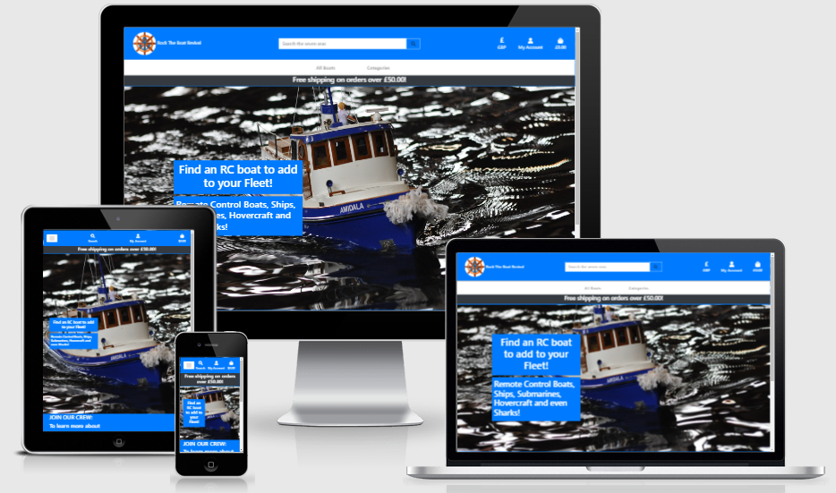

# Rock the Boat Revival

This website has been created for users to buy and review a selection of RC Boats.

The live site can be found [here](https://rock-the-boat.herokuapp.com/)

## Table of Contents

* [User Experience](#user-experience)

    * [User stories](#user-stories)
    * [Admin Stories](#admin-stories)

* [Planning](#planning)

* [Features](#features)

* [Future Features](#future-features)

* [Django apps and models](#django-apps-and-models)

* [Testing](#testing)

* [Languages and Programs Used](#languages-and-programs-used)

    * [Languages](#languages)

    * [Libraries and Frameworks](#libraries-and-frameworks)

    * [Development tools](#development-tools)

    * [Required modules](#required-modules)

* [Credits](#credits)

## User Experience

### User stories

As a user I would like to be able to...

* Products

    * View all products so that I can select some to purchase
    * View a paginated list of products so that I can view a select few at a time without having to scroll too much
    * View individual product details so that I can see the price, size, location and other details more clearly
* Profile

    * Register for an account so that I can have a personal account and view my profile
    * Login and logout easily so that I can access my personal account and logout to prevent others from accessing it
    * Have a personalised profile so that I can view my order history and reviews
* Bag

    * Keep track of all the products I am wanting to purchase so that I can continue shopping and purchase 
    * See the total price of my purchases so that I can keep track of how much I'm spending and avoid spending too much
* Currency

    * Change currency so that I understand the cost of my purchases in my local currency
* Filter & Sort
    * Filter by category so that I can easily find the product I want within the categories I want
    * Search for a product so that I can find a specific product to buy
    * Sort a list of products so that I can easily identify the best priced and categories that I want
* Reviews

    * View a list of reviews so that I can see other shoppers opinions
    * Leave a review for a game so that my opinion is heard and I can be involved in rating the game
    * Edit or delete my review in order to show my change of opinion or remove mistakes
* Discounts
    * Enter discount codes so that I can save money when buying products

### Shop Owner Stories

As a store owner I would like to be able to...

* Products

    * Add new products so that I can sell new products
    * Edit products so that I can adjust product details
    * Delete products so that I can remove products that are no longer being sold
    * Secure the site so that I can prevent unauthorised users from adding/editing/deleting products
* Reviews

    * Secure the reviews so that I can prevent users from being able to delete other users reviews
    * Only allow users to review products they've bought to prevent false reviews

## Planning

* Colour scheme

    * Using colours with a good contrast ratio for legibility
    * The colours also match the main background image on the index page

* Figma

    * wireframes

## Features

* Index

    * Logo
        * The logo was made using [Canva](https://www.canva.com/)
        * Used as a link to return to the home page
        * Primarily using #226699 and #F28E44 colours to contrast with the white background

        

    * Search Bar

        * A search bar available on all page headers
        * Filters products with boat data that contains the search terms

    * Nav

        * A drop down menu to choose between currencies
        * Once an item is in the bag the currency cannot be changed to avoid Orders with multiple currencies
        * A drop down menu to Signup, Login or Logout depending on the login status
        * A grand total keeping track of the products the user has selected in their chosen currency
        

    * Banner

        * A drop down list of all the categories to filter the products
        * A drop down list of options for sorting all the products as well as a link to the default 'all boats'
        * A banner reminding the user of the free shipping threshold to encourage the user to spend more

    * Slogan and Image
        * A slogan to tell the user what the website is about as well as use SEO key words relevant to what is being sold
        * A nice background image for the index page that matches the colour scheme of the site and gives the user an idea of what is being sold

    * Footer
        * A link to the website's Facebook page, encouraging users to like and follow
        * A call to action to join the website's mailing list using MailChimp
        * An arrow button at the top of the footer is provided to jump back to the top of the page

* Products

    * More sorting options in a dropdown menu offering descending and ascending order

    * List of all products with some info on each RC Boat ordering my the amount of views each has gotten to that the most popular start at the top

    * The products are paginated when more than 8 fit a screen, more pages are made for more products. If there are too many pages to show then the paginator will only show the previous and next 5 pages as well as links to the first and last page

    * If a url is inserted with a page number that is larger than the total then the user will be redirected to the last page

    * If a url is inserted with a non integer as the page number or the page is not found then the user will be redirected to the first page

* Product Detail

    * A user is able to see all the products details in this template

    * Edit and Delete Buttons are on this page and the previous for admin uses to quickly edit or delete products and they are restricted to no superusers

    * A user can select the quantity of the product they wish to add to their bag before they submit it

    * Users are able to view reviews given to this product, but are only able to create review if they are signed in and if they have bought the RC Boat in an order, which gives them and edd review button in their profile

    * Users can edit and delete their reviews with the edit and delete buttons but these button are restricted for reviews they have not written

* Add/Edit product

    * Admin can add and edit products on these templates
    * Secured so that only an admin can access these pages
    * And if editing the product the admin can see a preview of the product image instead of just a url

* Profile

    * During an order or on this profile page a user, if signed in, can saved their delivery information to be saved for a future order to prevent having to fill it in everytime if the save info button is ticked

    * Their delivery information can be editted on this page too

    * A user can view their order history and can click on them and see the full details of the order

    * The user can see a list of boughts they have bought in the past and is given add review buttons for each now that they have purchased them. This is to prevent false reviews from users who have not purchased the product

    * The user can also see all reviews they have created on the site and can edit or delete them from this page

* Bag

    * View all products currently in the fleet before purchasing

    * Can ajust quantity of product before heading to checkout

    * Can remove products no longer wanted

    * Can apply discount codes and see how much you've saved

    * Be reminded how close you are to the delivery threshold so encourage users who have not reached the threshold to purchase more

* Checkout

    * Can view the items about to be purchased and their subtotals

    * Can fill in delivery information

    * Can save delivery information to profile to be used again next time

    * Checkout success page to view order and confirm it went through correctly and doubles as order history detail page

    * Sends a webhook to [stripe](stripe.com) incase the user closes the site before the form is submitted and the webhook can recreate the order if it iis not found to prevent being charged without the order going through

* Reviews

    * Create reviews with resposive stars to represent score

    * Can edit previous reviews

    * Edit and delete links hidden for reviews made by other users

## Future Features

* Delete modal

## Django Apps and Models

## Testing

### HTML

* Tested using the official [W3C Validator](https://validator.w3.org/)
* Removed Duplicate Ids
* Put li elements into a ul element

### CSS

* Tested using the official [Jigsaw W3C Validator](https://jigsaw.w3.org/css-validator/)

### JavaScript

* Tested using [JSHint JavaScript Validator](https://jshint.com/)
* Added missing semicolons

### Python

* Testing using flake8
* Shortened lines that were too long
* Removed imports that were not used

### Browsers

* Tested on Google Chrome, Internet Explorer, Microsoft Edge and even the Samsung Internet App on Mobile and Tablet

### Responsiveness

* Tested responsiveness on a Samsung A21 Phone, Samsung Galaxy Tablet and Desktop
* Tested with Google Chrome Development tools for different screen sizes

### Accessibility

* Tested using a web accessibility evaluation tool called [Wave](https://wave.webaim.org/)
* Semantic HTML is used
* Changed main background colour to #0054AD for a better contrast ratio
* Added aria-labels and alt texts

## Languages and Programs Used

### Languages

* HTML5 for site structure
* CSS3 for styling
* JavaScript for star ratings and message timeouts
* Python 3.0 for Django

### Libraries and Frameworks

* [Django](https://www.djangoproject.com/)'s model view template structure was used to create apps and run them
* [Boostrap4](https://getbootstrap.com/docs/4.5/getting-started/introduction/) framework used for responsive styling and templates

### Development tools
* Git for version control
* VS Code as IDE (integrated development environment)
* PIP to install packages
* Postgresql for the database to create content and manage data
* Heroku used for deployment
* Stripe used for handling payments and webhooks
* AWS used for cloud hosting for static and media files

### Required modules

All modules required are located in the [requirements.txt](requirements.txt) file.

## Deployment

### Heroku

Create Heroku App

    1. Create Heroku account and login
    2. Click new then create new app
    3. Name app a unique name
    4. Select your region most appropriate for you

Link Gitpod workspace to Heroku App \
(Heroku have removed the functionality to deploy Github apps through the Heroku Dashboard)

    1. In the gitpod terminal run the commad 'heroku login -i'
    2. Login with your email and password
    3. Run the command 'heroku git:remote -a your_app_name_here', replacing 'your_app_name_here' with your app name
    4. Automatic deployments are no longer available at time of writing so after each 'git push' you need to also run 'git push heroku main' to manually deploy

Add Postgresql Database

    1. Click onto the Resources Tab
    2. Under Add ons search for Heroku Postgres
    3. Select Hobby Dev - Free plan
    4. Submit order form

Set Environment Variables

    1. Click onto the Settings tab
    2. Click reveal Config Vars.
    3. Add the variables below
    4. Set them as follows

|Key | Value|
--- | ---|
|AWS_ACCESS_KEY_ID | (AWS Access key)|
|AWS_SECRET_ACCESS_KEY | (AWS Secret Access key)|
|DATABASE_URL | (Postgresql Database url)|
|EMAIL_HOST_PASS | (Email Host password)|
|EMAIL_HOST_USER | (Email Address)|
|SECRET_KEY | (Secret Key value)|
|STRIPE_PUBLIC_KEY | (Stripe Public Key value)|
|STRIPE_SECRET_KEY | (Stripe Secret Key value)|
|STRIPE_WH_SECRET | (Stripe WH Key value)|
|USE_AWS | True|

### AWS Configuration

Amazon AWS S3 Bucket

    1. Creat an AWS account and login
    2. Go to Services then S3
    3. Create an S3 bucket
    4. Untick 'Block all public access' to make is publically accessable
    5. Create and apply bucket policy, Cross-origin resource sharing (CORS), Access Control List (ACL)
    6. Go to services then IAM
    7. Go to policies and create bucket policy
    8. Add a JSON file with your policy arn in the Resource
    9. Creat User Group and User to manage the S3 bucket
    10. Upload media files into the S3 bucket through the AWS console
    11. Copy the AWS_ACCESS_KEY_ID and AWS_SECRET_ACCESS_KEY values to the Config Vars in Heroku.

## Credits

* RC Boat images and data was used from [Zeptronics](https://www.zeptotronics.net/)
* JavaScript code for star ratings is based on code from [Brad Traversy](https://codepen.io/bradtraversy/pen/GQLRZv)
* Pagination styling based on [Codemy.com](https://www.youtube.com/channel/UCFB0dxMudkws1q8w5NJEAmw)'s video on Pagination
* [Bootstrap cheatsheet](https://hackerthemes.com/bootstrap-cheatsheet/) helped by listing boostrap classes in an easy to find manner
* [Boostrap Templates and Examples](https://getbootstrap.com/docs/5.1/examples/) used as a basis for some features
* [Font Awesome](https://fontawesome.com/) used for the stars
* [W3Schools](https://www.w3schools.com/) used for reference in using coding [languages](#languages)
* [Stack Overflow](https://stackoverflow.com/) was used to find solution to some coding issues
* The [Code Institute](https://codeinstitute.net/) study material was used